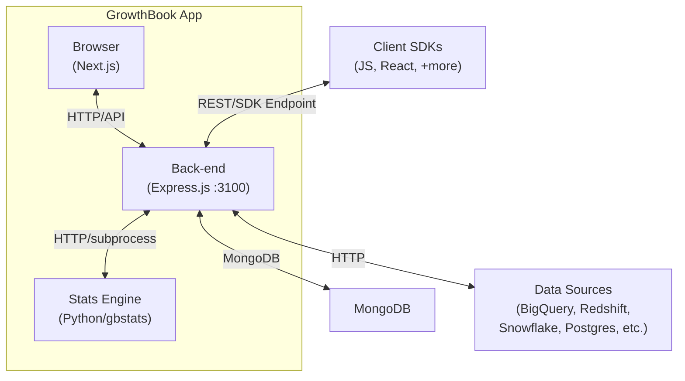

# GrowthBook Architecture

## System Overview

GrowthBook is an open source feature flagging and A/B testing platform. It consists of a web application (Next.js front-end + Express.js back-end backed by MongoDB), a Python statistical analysis engine, and JavaScript/React client SDKs. The platform lets engineering teams manage feature flags with targeting rules, run A/B experiments, and analyze results using Bayesian or frequentist statistics against their existing data warehouse.

## Architecture Diagram

## Component Map

| Directory | Responsibility |
|-----------|---------------|
| `packages/front-end/pages/` | Next.js pages (route entry points) |
| `packages/front-end/components/` | Reusable React components |
| `packages/front-end/services/` | API client utilities, auth helpers |
| `packages/back-end/src/routers/` | Express router definitions (thin) |
| `packages/back-end/src/controllers/` | HTTP request handlers |
| `packages/back-end/src/api/` | REST API v1 routes and OpenAPI spec |
| `packages/back-end/src/services/` | Business logic and orchestration |
| `packages/back-end/src/models/` | Mongoose models (data layer) |
| `packages/back-end/src/jobs/` | Agenda.js scheduled/background jobs |
| `packages/back-end/src/integrations/` | Data source connectors (SQL, analytics) |
| `packages/back-end/src/events/` | Event system and webhook handlers |
| `packages/back-end/src/middleware/` | Express middleware (auth, rate limiting) |
| `packages/back-end/src/util/secrets.ts` | All env var / config access |
| `packages/back-end/src/enterprise/` | Commercial-licensed features (RBAC, SSO, etc.) |
| `packages/shared/src/` | Shared TypeScript types and utilities |
| `packages/stats/gbstats/` | Python stats engine (Bayesian, frequentist, CUPED) |
| `packages/sdk-js/` | JS SDK (`@growthbook/growthbook`) |
| `packages/sdk-react/` | React SDK (`@growthbook/growthbook-react`) |
| `docs/` | Docusaurus documentation site |

## Request Flow

### Web App Request (authenticated UI)
1. Browser sends request to Next.js front-end (`:3000`)
2. Front-end calls Express back-end REST API (`:3100`)
3. Back-end middleware validates JWT, builds `Context` (org, user, permissions)
4. Router delegates to controller via `wrapController()`
5. Controller calls service layer for business logic
6. Services access data via model layer (Mongoose/MongoDB)
7. Response returned to browser

### Experiment Analysis
1. Scheduled job (`updateExperimentResults`) or user trigger starts analysis
2. Back-end queries data source (BigQuery, Redshift, Snowflake, etc.) for raw metrics
3. Query results passed to Python stats engine (`gbstats`)
4. Stats engine computes Bayesian/frequentist test results, CUPED adjustments, SRM checks
5. Results stored as `ExperimentSnapshot` in MongoDB
6. Front-end fetches and displays results

### SDK Feature Flag Evaluation
1. Client SDK fetches feature flag payload from back-end SDK endpoint
2. SDK evaluates targeting rules, experiments, and rollouts **locally** (no per-request calls)
3. Impression events sent to customer's own analytics (GA, Segment, Mixpanel, etc.)

## Key Design Decisions

### Router → Controller → Service → Model Layering
Routers are thin (route definitions only). Controllers handle HTTP concerns. Services contain all business logic. Models are the only layer that touches MongoDB directly. This separation keeps code testable and prevents coupling to HTTP semantics.

### Context Object for Auth and Permissions
All authenticated requests build a `Context` object (`services/context.ts`) containing the organization, user, resolved permissions, and scoped model accessors. Controllers and services access everything through the context rather than re-resolving auth per call.

### Enterprise Separation
Each of `front-end`, `back-end`, and `shared` has an `enterprise/` subdirectory containing GrowthBook Enterprise License code (RBAC, SSO, AI features, etc.). Open source contributions are not accepted in these directories. Enterprise features are tree-shaken in open source builds.

### Local SDK Evaluation
Client SDKs evaluate feature flags and experiments entirely locally after downloading a payload. No per-impression HTTP call is made to GrowthBook servers, ensuring zero latency impact and no single point of failure.

### All Config via `secrets.ts`
All environment variables and configuration are accessed through `packages/back-end/src/util/secrets.ts`. Controllers and services never call `process.env` directly, which makes config auditable and testable.

## External Dependencies

| Service | Protocol | Purpose |
|---------|----------|---------|
| MongoDB | TCP | Primary data store for all app data |
| BigQuery / Redshift / Snowflake / Postgres / MySQL / Athena / ClickHouse / Databricks | SQL/HTTP | Data sources for experiment metrics |
| Google Analytics / Mixpanel | HTTP | Analytics data sources |
| AWS S3 / GCS | HTTP | File uploads (cloud deployments) |
| AWS SES / SMTP | SMTP | Transactional email |
| Sentry | HTTP | Error tracking |
| DataDog / OpenTelemetry | HTTP | Observability and tracing |
| Stripe | HTTP | Billing (cloud deployment) |

## Cross-Cutting Concerns

### Configuration
All secrets and env vars are accessed via `packages/back-end/src/util/secrets.ts`. Front-end config uses Next.js env vars (`packages/front-end/.env.local`).

### Observability
Back-end supports OpenTelemetry (`tracing.opentelemetry.ts`) and DataDog (`tracing.datadog.ts`). Structured logging via `pino`. Sentry for error tracking in both front-end and back-end.

### Background Jobs
Agenda.js powers background jobs (experiment result updates, scheduled feature flag changes, webhook delivery, license updates). Jobs are in `packages/back-end/src/jobs/`.

### Permissions
RBAC is enforced server-side through the `Context` object. The `enterprise/` package provides advanced role and team management. All permission checks use `context.permissions.throwIfCannotXxx()`.
